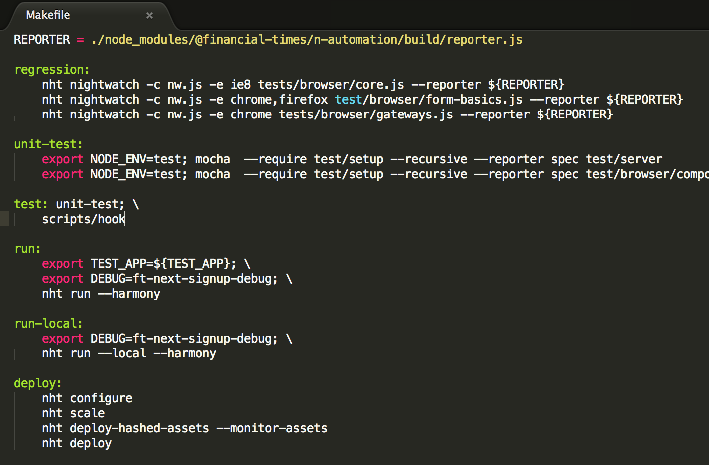
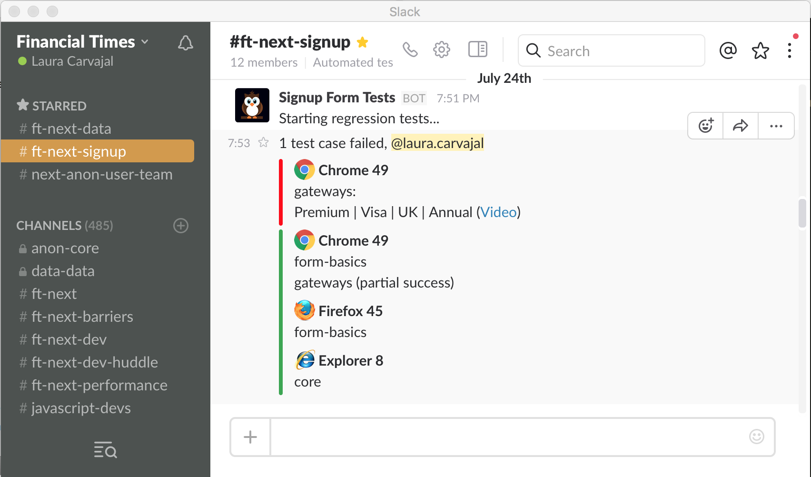

# n-automation [](https://circleci.com/gh/Financial-Times/n-automation)

Run automated [regression tests](https://en.wikipedia.org/wiki/Regression_testing) for your app using [nightwatch.js](http://nightwatchjs.org/) and get results on Slack and email.

 

## Installation

`npm install @financial-times/n-automation`

## Usage

### Makefile
Write a `regression` recipe on your Makefile containing the tests you'd like to run, passing the `n-automation` reporter to `nht nightwatch`:
```bash
REPORTER = ./node_modules/@financial-times/n-automation/build/reporter.js

regression-core:
	nht nightwatch -c nightwatch.js path/to/test.js --reporter ${REPORTER}
	nht nightwatch -c nightwatch.js path/to/anotherTest.js --reporter ${REPORTER}
	...
```

### Init

Init `n-automation` in an independent file somewhere in your project, for example `jobs/run-regression.js`:

```js
const Automation = require('@financial-times/n-automation');

Automation.run({
	appName: 'Your App Name',
	nightwatchJson: require('../nightwatch.js')
});
```
Only pass in `nightwatchJson` if your project has a nightwatch config. If not, send only `appName` and `n-automation` will default to the `n-heroku-tools` [nightwatch config file](https://github.com/Financial-Times/n-heroku-tools/blob/master/config/nightwatch.json)

### Env Variables

- `process.env.SLACK_URL` Slack [Incoming Webhook Integration URL](https://financialtimes.slack.com/apps/new/A0F7XDUAZ-incoming-webhooks) for the channel to notify
- `process.env.SLACK_MENTIONS` Slack users to mention on failure (optional)
- `process.env.REGRESSION_RECIPIENTS` email addresses of the people to notify on test failure

### Heroku Schedule

Schedule your job with something like the [Heroku Scheduler](https://elements.heroku.com/addons/scheduler). Once a day is recommended.

### Email on failure

Full nightwatch output will be sent to the email addresses above whenever a test fails.

### Examples

See [next-signup](https://github.com/Financial-Times/next-signup)
